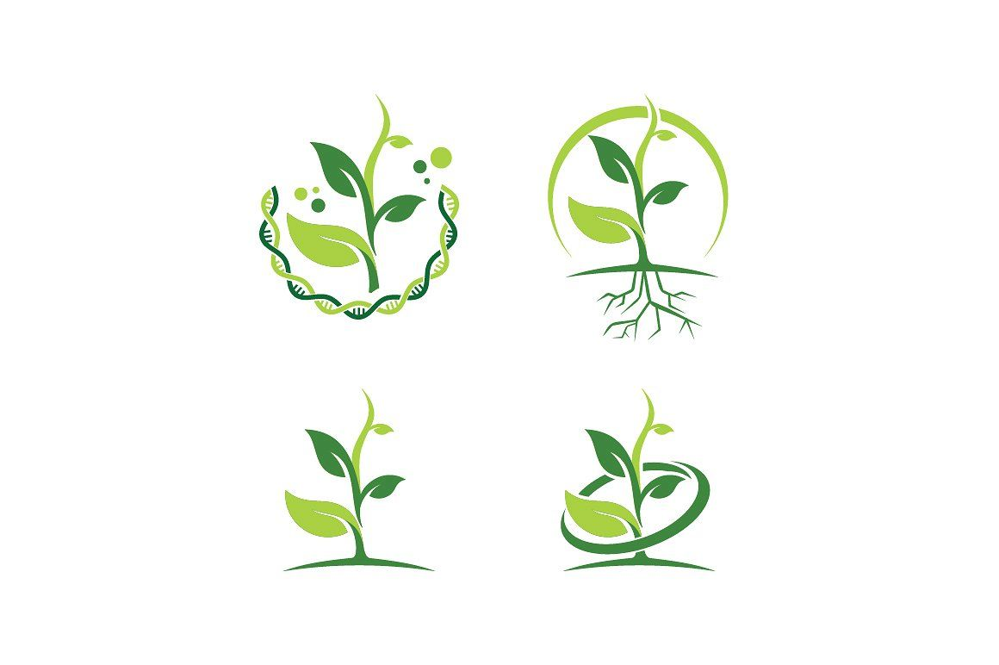

<!DOCTYPE html>
<html lang="en">
<head>
    <meta charset="UTF-8">
    <meta name="viewport" content="width=device-width, initial-scale=1.0">
    <title>Portfolio Website</title>
    <!-- Bootstrap CSS -->
    <link href="https://stackpath.bootstrapcdn.com/bootstrap/4.5.2/css/bootstrap.min.css" rel="stylesheet">
    
</head>
<body>
    <!-- Navigation Bar -->
    <nav class="navbar navbar-expand-lg navbar-dark bg-dark">
        <a class="navbar-brand" href="#">Ratnesh Karjee</a>
        <button class="navbar-toggler" type="button" data-toggle="collapse" data-target="#navbarNav" aria-controls="navbarNav" aria-expanded="false" aria-label="Toggle navigation">
            
        </button>
        

            <ul class="navbar-nav">
                <li class="nav-item"><a class="nav-link" href="#home">Home</a></li>
                <li class="nav-item"><a class="nav-link" href="#about">About Me</a></li>
                <li class="nav-item"><a class="nav-link" href="#research">Research Interests</a></li>
                <li class="nav-item"><a class="nav-link" href="#skills">Skills & Expertise</a></li>
                <li class="nav-item"><a class="nav-link" href="#publications">Selected Publications</a></li>
                <li class="nav-item"><a class="nav-link" href="#contact">Contact Me</a></li>
            </ul>
        

    </nav>

    <!-- Home Section -->
    <section id="home" class="section">
        

            

                

                    
                

                

                    <h1>Welcome to My Portfolio</h1>
                    
Discover more about my research, skills, and experience.

                

            

        

    </section>

    <!-- Selected Publications Section -->
    <section id="publications" class="section bg-light">
        

            <h2 class="section-heading text-center">Selected Publications</h2>
            <ul>
                <li><strong>Ghosh, D.</strong>, <strong>Karjee, R.</strong>, and <strong>Subramanian, K. A.</strong> 2024. Notes on the Cleptoparasitic Bees from Tawang District in Arunachal Pradesh, India with Special Reference to Family Apidae of Order Hymenoptera. Records of Zoological Survey of India. 124 (iS), 501-512. doi:10.26515/rzsi/v124/i1S/2024/172758</li>
                <li><strong>Ghosh, D.</strong>, <strong>Chatterjee, P.</strong>, <strong>Karjee, R.</strong>, and <strong>Subramanian, K.A.</strong> 2023. Flower visitor assemblage and foraging profile of a pollinator attractant non-crop plant Isodon coetsa (Buch.-Ham. ex D.Don) Kudô from eastern Himalayas, India. Proceedings of Zoological Society. <a href="https://doi.org/10.1007/s12595-023-00498-x" target="_blank">https://doi.org/10.1007/s12595-023-00498-x</a></li>
                <li><strong>Karjee, R.</strong>, <strong>Palei, H. S.</strong>, <strong>Konwar, A.</strong>, <strong>Gogoi, A.</strong>, & <strong>Mishra, R. K.</strong> 2022. Bird assemblages in a peri-urban landscape in eastern India. Birds. 3(4), 383-401 <a href="https://doi.org/10.3390/birds3040026" target="_blank">https://doi.org/10.3390/birds3040026</a></li>
                <li><strong>Patra, A.</strong>, <strong>Ahmed, T.M.</strong>, <strong>Karjee, R.</strong>, and <strong>Bhandari, S.</strong> 2019. Sighting of madras tree shrew Anathana ellioti (Waterhouse, 1850) with first photographic evidence at Ajodhya range, district Purulia, West Bengal, India. International Journal of Fauna and Biological Studies. 6(1):41-42</li>
            </ul>
        

    </section>

    <!-- About Me Section -->
    <section id="about" class="section bg-light">
        

            <h2 class="section-heading text-center">About Me</h2>
            

                

                    
                

                

                    
<strong>Hello, I am Ratnesh Karjee</strong>, a Wildlife Biologist and currently pursuing a PhD at <a href="https://www.ashoka.edu.in/" target="_blank">Ashoka University</a> in the Department of Biology. Before joining Ashoka, I completed my master’s degree in Wildlife & Biodiversity Conservation at <a href="https://www.nou.nic.in/" target="_blank">North Orissa University</a>. In 2019, I was hired as a research biologist by the <a href="https://zsi.gov.in/" target="_blank">Zoological Survey of India</a>. I have several years of multidisciplinary research experience in various Indian landscapes, as well as competence in Taxonomy, Geospatial data processing, Biodiversity Impact Assessment, and Biodiversity Monitoring. I am passionate about human-animal conflict, landscape ecology, and the effects of the Anthropocene and climate change on wildlife. I was working at Ashoka University as a Junior Research Fellow on the project “Whole genome sequencing and comparative genomics to study the evolution, genetic diversity, and immunology of bats from the Indian subcontinent.” My interest lies in an integrated approach of modern tools like genomics and GIS to answer various ecological questions. Apart from academic and research pursuits, I love to play football, volleyball, cricket, and enjoy photography, hiking, birding, drawing, and painting.

                

            

        

    </section>

    <!-- Research Interests Section -->
    <section id="research" class="section">
        

            <h2 class="section-heading text-center">Research Interests</h2>
            

                

                    

                        
                        

                            <h5 class="card-title">Conservation Genomics</h5>
                            
Understanding the genetic diversity and evolution of species for better conservation strategies.

                        

                    

