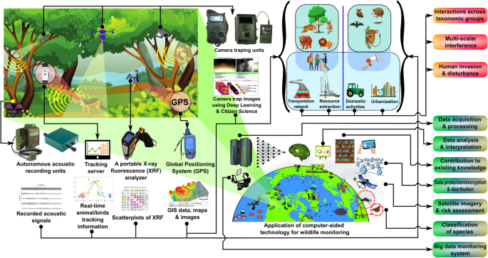

<html lang="en">
<head>
    <meta charset="UTF-8">
    <meta name="viewport" content="width=device-width, initial-scale=1.0">
    <!-- Bootstrap CSS -->
    <link rel="stylesheet" href="https://stackpath.bootstrapcdn.com/bootstrap/4.5.2/css/bootstrap.min.css">
    <!-- Custom CSS -->
    <link rel="stylesheet" href="styles.css">
    
</head>
<body>
    <!-- Navigation Bar -->
    <nav class="navbar navbar-expand-lg navbar-dark bg-dark">
        <a class="navbar-brand" href="#">Ratnesh Karjee</a>
        <button class="navbar-toggler" type="button" data-toggle="collapse" data-target="#navbarNav" aria-controls="navbarNav" aria-expanded="false" aria-label="Toggle navigation">
            
        </button>
        

            <ul class="navbar-nav">
                <li class="nav-item">
                    <a class="nav-link" href="#home">Home</a>
                </li>
                <li class="nav-item">
                    <a class="nav-link" href="#about">About Me</a>
                </li>
                <li class="nav-item">
                    <a class="nav-link" href="#skills">Skills & Expertise</a>
                </li>
                <li class="nav-item">
                    <a class="nav-link" href="#publications">Selected Publications</a>
                </li>
                <li class="nav-item">
                    <a class="nav-link" href="#contact">Contact Me</a>
                </li>
            </ul>
        

    </nav>

    <!-- Home Section -->
    <section id="home" class="section">
        

            

                

                    
                

                

                    <h1>Welcome to My Scientific World</h1>
                    
Hi, Welcome to my portfolio where you can explore my research, skills, and publications. My curiosity to explore and discover new skills and gained knowledges for any research. I believe that this is the foundation of an excellent researcher. Growing up in a village of Purulia District in West Bengal, I was intrigued when I first encountered subjects such as animal behaviour in my Bachelor’s degree coursework. These courses helped me better understand the animals I had seen during my childhood, including the rolling eggs of hens, defensive behaviour of chickens, and human-elephant conflicts in my region. I believe this was the start of my journey in wildlife studies. If my research interests and skills resonate with you, I would be delighted to explore potential collaboration opportunities in the future. Please feel free to reach out if you're interested in working together!

                

            

        

    </section>

    <!-- About Me Section -->
    <section id="about" class="section bg-light">
        

            <h2 class="section-heading text-center">About Me</h2>
            

                

                    
                

                

                    
I'm Ratnesh Karjee, a Wildlife Biologist currently pursuing a Ph.D. in Biology at <a href="https://www.ashoka.edu.in" target="_blank">Ashoka University</a>. The theme of my doctoral research is based on understanding the influence of the Anthropocene and climate change on small mammals, particularly bats and rodents, across India’s key biodiversity hotspots—the Northeast (NEI) and the Western Ghats (WG). Both the regions are globally recognized for their rich biodiversity and unique ecological significance.
                    I earned my master’s degree in wildlife & Biodiversity Conservation from <a href= "https://www.nou.nic.in/" target="_blank">North Orissa University</a> and have previously worked as a research biologist at the <a href= "https://zsi.gov.in/" target="_blank">Zoological Survey of India</a>. In addition, I have muldisciplinary research experience in various domain of biology like taxonomy, geospatial data processing, biodiversity impact assessment, and monitoring. My deep commitment to addressing human-animal conflicts, coupled with a passion for landscape ecology, fuels my research. I was also engaged in an innovative project on bat genomics at Ashoka University. Moreover, I am interested in integrating advanced genomics techniques and GIS tools to push the boundaries of ecological research and enhance our understanding for sustainable conservation practice.

                

            

        

    </section>

    <!-- Skills & Expertise Section -->
    <section id="skills" class="section bg-light">
        

            <h2 class="section-heading text-center">Skills & Expertise</h2>
            

                <!-- Skill Card 1 -->
                

                    

                        
                        

                            <h5 class="card-title">Remote Sensing & GIS</h5>
                            
I am proficient in geospatial modelling (including Species Distribution Modelling). Apart from this, I use to teach and provide technical assistance to graduate students, interns, and professionals in RS and GIS. In addition, I can handle various software like QGIS, ArcGIS, GeoDa, Google Earth Engine, and Diva-GIS.

                        

                    

                

                <!-- Skill Card 2 -->
                

                    

                        
                        

                            <h5 class="card-title">Molecular & Ecological Data Analysis</h5>
                            
I have expertise in analyzing ecological and genomic data using various software such as R, PopArt, DnaSP, and MEGA.

                        

                    

                

                <!-- Skill Card 3 -->
                

                    

                        
                        

                            <h5 class="card-title">Field Experience</h5>
                            
I have five years of working experience in various landscapes of India like the Eastern & Western Himalayas, Western Ghats, Gangetic Flood Plain, Chotanagpur, etc., which helps me to gain systematic study design, conduct field surveys, data collection, and lead team members. In addition, my expertise in monitoring wildlife using non-invasive sampling methods like camera traps, fecal, and sign surveys.

                        

                    

                

                <!-- Skill Card 4 -->
                

                    

                        
                        

                            <h5 class="card-title">Biodiversity Monitoring, Conservation & Impact Assessment</h5>
                            
I possess expertise in conducting systematic field studies to assess biodiversity (invertebrates and vertebrates). I can design experiment for biodiversity management and impact assessment for sustainable conservation practices. In addition, during my master’s course, I also prepared People Biodiversity Register (PBR) using both Traditional Ecological Knowledge (TEK) and scientific methods. Furthermore, I can identify bats, scorpions, and centipedes through morphological taxonomy.

                        

                    

                

            

        

    </section>

    <!-- Selected Publications Section -->
    <section id="publications" class="section">
        

            <h2 class="section-heading text-center">Selected Publications</h2>
            <ul class="list-unstyled">
                <li><strong>Ghosh, D., Karjee, R., and Subramanian, K. A. 2024.</strong> Notes on the Cleptoparasitic Bees from Tawang District in Arunachal Pradesh, India with Special Reference to Family Apidae of Order Hymenoptera. Records of Zoological Survey of India. 124 (iS), 501-512. <a href="https://doi.org/10.26515/rzsi/v124/i1S/2024/172758" target="_blank">[online]</a></li>
            <li><strong>Ghosh, D., Chatterjee, P., Karjee, R., and Subramanian, K.A. 2023.</strong> Flower visitor assemblage and foraging profile of a pollinator attractant non-crop plant Isodon coetsa (Buch.-Ham. ex D.Don) Kudô from eastern Himalayas, India. Proceedings of Zoological Society. <a href="https://doi.org/10.1007/s12595-023-00498-x" target="_blank">[online]</a></li>
            <li><strong>Karjee, R., Palei, H. S., Konwar, A., Gogoi, A., & Mishra, R. K. 2022.</strong> Bird assemblages in a peri-urban landscape in eastern India. Birds. 3(4), 383-401 <a href="https://doi.org/10.3390/birds3040026" target="_blank">[online]</a></li>
            <li><strong>Patra, A., Ahmed, T.M., Karjee, R., and Bhandari, S. 2019.</strong> Sighting of madras tree shrew Anathana ellioti (Waterhouse, 1850) with first photographic evidence at Ajodhya range, district Purulia, West Bengal, India. International Journal of Fauna and Biological Studies. 6(1):41-42<a href="https://www.researchgate.net/publication/340810168_Sighting_of_madras_tree_shrew_Anathana_ellioti_Waterhouse_1850_with_first_photographic_evidence_at_Ajodhya_range_district_Purulia_West_Bengal_India" target="_blank">[online]</a></li>
            </ul>
        

    </section>

    <!-- Contact Me Section -->
    <section id="contact" class="section bg-light">
        

            <h2 class="section-heading">Contact Me</h2>
            

                

                    <a href="mailto:ratneshkarjee@example.com" class="btn btn-primary">Email</a>
                    <a href="https://scholar.google.com/citations?user=XXXXXX" class="btn btn-primary">Google Scholar</a>
                    <a href="https://www.researchgate.net/profile/Ratnesh_Karjee" class="btn btn-primary">ResearchGate</a>
                    <a href="https://github.com/ratneshkarjee" class="btn btn-primary">GitHub</a>
                

            

        

    </section>

    <!-- Bootstrap JS and dependencies -->
    
    
    
</body>
</html>
